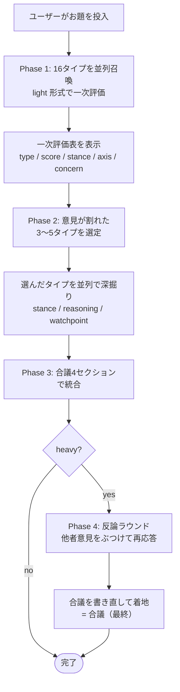

MBTI 16タイプの人格に合議させる Claude Code プラグイン『16-minds』を作った

# きっかけ ― レビューが「無難すぎる」問題

Claude にコードレビューを頼むと、無難で平均的な答えが返ってくる。

> 「概ね問題なさそうですが、◯◯には注意が必要かもしれません」

困らないけど、刺さらない。波風立たないやつ。

自分が本当に欲しいのは、立場の違う人間が真剣にぶつかった後の **「あ、その軸で見るとこれってヤバいんじゃない？」** という、議論の残骸から拾える発見の方だった。

そこで、Claude Code の subagent 機能を使って、**16タイプの人格を並列に召喚して喧嘩させる** プラグインを書いた。それが `16-minds`。

> リポジトリ: https://github.com/yukurash/16minds-plugin

---

# 1分でわかる動作

```
ユーザー: /minds このAPI設計、長期で破綻しない？
        │
        ▼
  ┌─────────────────────────────────┐
  │ 16タイプを並列召喚（並列度: 16）  │
  └─────────────────────────────────┘
        │
        ▼
  INTJ「3年後に詰む」  ENFP「めっちゃ可能性ある」
  ISTJ「前例は？」     ENTP「前提を壊そう」
  …16人ぶん返ってくる
        │
        ▼
  意見が割れたタイプを 3〜5人 選んで深掘り
        │
        ▼
  合議: score分布 / 対立軸 / 死角 / 落としどころ
```

返ってくる答えが「16人ぶんの偏った意見の塊」+「それを構造化した着地案」になるので、Claude 単体に聞いたときの "ふんわり感" が消える。

---

# コマンド一覧

コマンドは3つ。シグネチャは以下：

```
/mind  <type> [--mode=light|middle|heavy] <topic>
/pair  <a> <b> [--mode=light|middle|heavy] <topic>
/minds [--mode=light|middle|heavy] [--types=a,b,...] [--n=N] [--save] [--out=<path>] <topic>
```

それぞれの役割：

| コマンド | 用途 | 並列度 | 主な使いどころ |
|---|---|---|---|
| `/mind` | 1タイプの意見だけ欲しい | 1 | 特定の人格に絞って聞きたい |
| `/pair` | 2タイプにディベート（立論 → 反論 → 再反論／着地） | 2 | 対立構造をはっきり見たい |
| `/minds` | 16タイプ全員召喚＋合議 | 最大16 | 多様な視点を一気に集めて構造化したい |

## オプション一覧

| オプション | 対応 | 既定 | 説明 |
|---|---|---|---|
| `--mode=light｜middle｜heavy` | 全コマンド | `middle` | 出力の深さ（後述） |
| `--types=a,b,...` | `/minds` | 全16タイプ | カンマ区切りで対象タイプを絞り込む |
| `--n=N` | `/minds` | なし | 一覧順の先頭N個に絞る（`--types` 未指定時のみ） |
| `--save` | `/minds` | off | `Outputs/<timestamp>-minds-<mode>.md` に結果を保存 |
| `--out=<path>` | `/minds` | なし | 保存先を明示指定（指定すると `--save` も自動で有効） |

`--types` がよく使われる。たとえば「論理系3人だけ召喚」みたいに重さをコントロールしたいときに便利：

```bash
/minds --types=intj,intp,entj 次に採用する DB
/minds --mode=heavy --types=intj,enfp,istp このアーキテクチャ案
/minds --n=4 アイデア出しのウォーミングアップ
/minds --save Qiita記事のタイトル候補       # ログ保存
/minds --out=docs/decisions/db.md 採用するDB # 任意パスに保存
```

## モードは3段階

| モード | 1タイプの出力 | 全体フロー | 用途 |
|---|---|---|---|
| `light` | 4行 (score / stance / axis / concern) | Phase 1 のみ | 多様性をサクッと見る・トークン節約 |
| `middle`（既定）| 立場 + 理由 + watchpoint | Phase 1 → 2 → 3（合議） | 第一印象を満たす標準パス |
| `heavy` | + 反論ラウンド + 合議書き直し | Phase 1 → 2 → 3 → 4 → 合議（最終） | 重い意思決定・記事ネタ |

`light` は Phase 1 の表だけで終わり、`middle` は合議まで、`heavy` は16人で反論ラウンドを経て合議を書き直すところまで回る。重さと解像度のトレードオフを呼び出し側で選ばせる設計。

---

# 16タイプの内訳

性格類型を扱う以上、最低限 "誰が誰" の地図はあった方がいい。

| グループ | タイプ | キャラ傾向 |
|---|---|---|
| **分析家 (NT)** | INTJ / INTP / ENTJ / ENTP | 論理・戦略・反証・前提を疑う |
| **外交官 (NF)** | INFJ / INFP / ENFJ / ENFP | 意味・価値・人・物語 |
| **番人 (SJ)** | ISTJ / ISFJ / ESTJ / ESFJ | 実証・伝統・責任・前例 |
| **探検家 (SP)** | ISTP / ISFP / ESTP / ESFP | 体験・実物・今この瞬間 |

`/minds` を1回回すと、この4グループから16人ぶん意見が返ってくる。

---

# 処理フロー（`/minds` heavy モード）



middle モードは Phase 3 まで、heavy は Phase 4 → 書き直しまで回る。

---

# 設計で意識的に守った4つのルール

地味だけど、ここがたぶん一番重要。

## ① 人格はプロンプトに直書きする

「価値観ベクトル表」みたいな中央集権データ構造は持たない。`agents/intj.md` の Markdown ファイルに、認知機能・価値観・強み・弱み・口調・典型的な言い回しを全部直書きしている。

別ファイルで構造化したくなる気持ちはあるが、それをやると agent 定義と二重管理になって絶対崩壊する。YAGNI でいい。

## ② subagent への呼び出しは必ず並列

`/minds` は最大16並列に広がる。これを逐次にした瞬間、レイテンシが現実的でなくなる。

| 方式 | 所要時間（概算） |
|---|---|
| 逐次 | `t × 16`（1タイプ7秒なら **2分弱**） |
| 並列 | `max(t_i)` ≒ **7〜10秒** |

`Task` ツールを「同一メッセージ内で複数回呼ぶ」という Claude Code の作法に乗っかってるだけだが、これがやれないとプラグインとして成立しない。

## ③ 出力フォーマットは呼び出し元コマンドが指定する

agent 側にフォーマット仕様は持たせない。理由：

> 16 タイプ × 3 モード × フォーマット指定 = **48 通りの組み合わせ爆発**

agent は人格表現に専念、フォーマットは command 側で一元管理。これで「`light` モードを増やす」みたいな変更が agent 16ファイルに波及しない。

## ④ subagent の出力は加工せずに表示する

これも明示的に禁止事項として書いてある。

> 要約や言い換えは禁止

INTJ の乾いた断定的口調や ENFP の「めっちゃいい」のテンションを、メインの assistant が手で均すと、人格を16個に分けている意味がなくなる。**生のまま貼る**。

---

# 合議パートは「4セクション固定」にした

最初これを書いてなかったとき、合議パートが毎回ぐちゃぐちゃに発散した。LLM は自由にしてあげると本気で何でも書いてくる。

なので、`/minds` の合議は以下の4セクション **固定** にした：

| # | セクション | 中身 |
|---|---|---|
| 1 | **score 分布** | 最低・最頻・最高を1文で |
| 2 | **主要な対立軸**（2〜3個）| 各軸の代表タイプ群を併記 |
| 3 | **見落とされがちな視点**（1〜3個）| 出典タイプを明記 |
| 4 | **落としどころ候補**（2〜3案）| 各案に「賛同しそうなタイプ／適性／リスク」を必ず付ける |

これがあると、Phase 1〜2 の生意見の塊が、必ず「対立 → 死角 → 着地案」の形に圧縮される。形が決まっていることが、議論の質を担保する。

---

# メタ実例 ― この記事のタイトルを16人に決めさせた

実は、この Qiita 記事のタイトル候補も `/minds` に決めさせた。完全ログはリポジトリの [`Outputs/qiita-title-discussion.md`](https://github.com/yukurash/16minds-plugin/blob/main/Outputs/qiita-title-discussion.md) に置いてある。

Phase 1 の表から面白かった4人を抜粋：

| type | score | 提案タイトル |
|---|---|---|
| **ESTP** | **5** | 「Claude Codeに16人格を同時召喚してみた。会議は一瞬で終わる」 |
| **ENTP** | 4 | 「会議は無能」と言われ続けた我々が、AIで16人格に会議させてみた件 |
| **INTJ** | 4 | Claude Codeに16人格を並列召喚する ― MBTI×subagentで「合議」を設計する |
| **ISFP** | 3 | 16人の私が話し出した夜のこと |

同じお題を投げてここまで散らばる。ESTP が満点で全振り「やってみた感」、ISFP は詩的でツール名すら出さない極端解。

合議パートで出た落としどころは：

> **メインに具体フック＋数字、副題で技術KWを補強する二段構成** が最も取りこぼしが少ない。

なるほど、ということでこの記事のタイトルも結果的にその指針通りになった。自分のプラグインに自分の記事のタイトルを決めさせるのは、思っていたよりは普通に役に立つ。

---

# ディレクトリ構造

```
16minds-plugin/
├── .claude-plugin/
│   └── plugin.json          # プラグインメタ情報
├── agents/                   # 16タイプの人格定義
│   ├── intj.md
│   ├── intp.md
│   ├── …                    （全16ファイル）
│   └── esfp.md
├── commands/                 # 3つのスラッシュコマンド
│   ├── mind.md              # 単一タイプ
│   ├── pair.md              # 2タイプディベート
│   └── minds.md             # 16タイプ全員召喚＋合議
├── Outputs/                  # /minds --save の保存先
├── README.md
└── LICENSE
```

agent は16ファイル、command は3ファイル。それだけ。

---

# ハマったところ

実装中によく転んだポイント。

| つまずき | どう解いたか |
|---|---|
| agent 側にフォーマット指示を書きそうになる | command 側で一元管理に倒した。組み合わせ爆発を回避 |
| subagent が「分析として総括します」と勝手にまとめを書く | 「**挨拶・前置き・まとめは一切不要**」を強めに明示 |
| ISFJ や INFP が score=3 ばかり返す慎重問題 | 仕様として受け入れた。人格的に妥当だから |
| 「人格を演じてください」だけだと診断口調になる | 認知機能・価値観・口調・典型的な言い回しまで全部書いて初めて演じる |
| Phase 3 の合議が回ごとに発散する | **4セクション固定ルブリック** を導入して落ち着いた |

最後の「4セクション固定」が一番効いた。プロンプトは構造で殴れ、というやつ。

---

# どんなお題に向いているか

| シチュエーション | 例 |
|---|---|
| 設計の意思決定 | `/minds このAPI設計、長期で破綻しない？` |
| 命名・タイトル決め | `/minds Qiita記事のタイトル案、刺さるのはどれ？` |
| ライフ／キャリア選択 | `/pair entj infp --mode=heavy 副業を本業化するか` |
| 倫理的トピック | `/minds AIによるコードレビューの是非` |
| アイデア発散 | `/mind enfp 今週末のリフレッシュ案を3つ出して` |
| コードベース判断 | `/pair istj entp --mode=heavy モノリスを分割するか維持するか` |

逆に **「答えが一意に決まる技術的事実の照会」** には向かない。`Math.PI` の値を16人に聞いてもしょうがない。意見が割れる余地があるお題でこそ刺さる。

---

# インストール

```
/plugin marketplace add yukurash/16minds-plugin
/plugin install 16-minds
```

ローカルで触りたいなら：

```
git clone https://github.com/yukurash/16minds-plugin
/plugin marketplace add <クローンしたパス>
/plugin install 16-minds
```

---

# おわりに

Claude のレビューが無難で物足りない、と感じている人には合うと思う。

**「平均的に正しい1人」より「偏った16人の喧嘩から拾う」** の方が、自分が考えていなかった角度に出会う確率は明確に高い。実際これを書いている間も、迷うたびに `/minds` に流して景色を変えてもらった。

リポジトリは MIT で公開している。気が向いたら触ってみてほしい。

- GitHub: https://github.com/yukurash/16minds-plugin
- ライセンス: MIT

---

# 商標について

このプラグインは Myers-Briggs Type Indicator® (MBTI®) の権利者である The Myers & Briggs Foundation、および 16Personalities® を提供する NERIS Analytics とは無関係であり、それらから認可・推奨を受けたものではありません。本記事およびプラグインで「16タイプ」と表記しているのは、心理学一般で広く参照される類型表現としての用法です。
